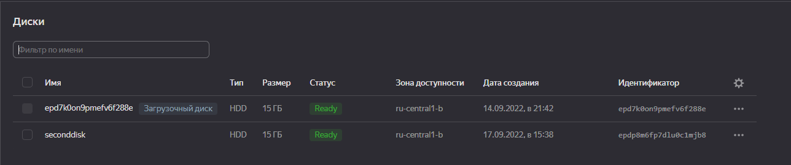
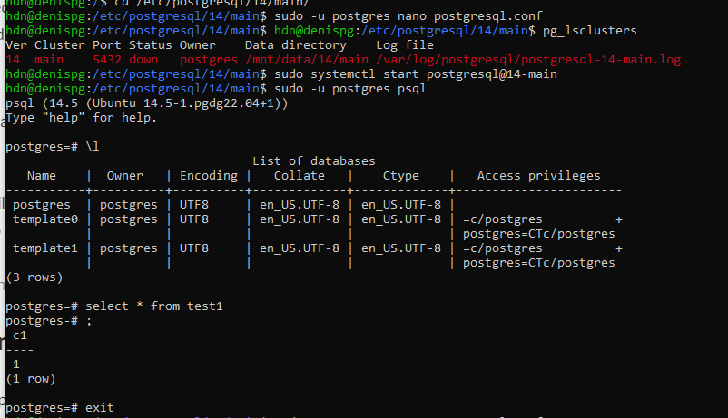

## проверьте что кластер запущен через sudo -u postgres pg_lsclusters

```
> hdn@denispg:/$ pg_lsclusters 
    > Ver Cluster Port Status Owner    Data directory                          Log file 
    > 14  main    5432 online postgres /var/lib/postgresql/14/main /var/log/postgresql/postgresql-14-main.log
```


## зайдите из под пользователя postgres в psql и сделайте произвольную таблицу с произвольным содержимым

```
> postgres=# create table test(c1 text); 
	> CREATE TABLE postgres=# insert
> into test values('1'); 
	> INSERT 0 1 postgres=#
```

## остановите postgres

```
> hdn@denispg:/$ sudo systemctl stop postgresql@14-main 
> hdn@denispg:/$> pg_lsclusters 
> Ver Cluster Port Status Owner    Data directory   					      Log file 
> 14  main    5432 down   postgres /var/lib/postgresql/14/main /var/log/postgresql/postgresql-14-main.log
```


## добавьте свеже-созданный диск к виртуальной машине



## проинициализируйте диск согласно инструкции и подмонтировать файловую систему

```
> hdn@denispg:~$sudo apt update && sudo apt install parted~
> hdn@denispg:~$ sudo parted  | grep Error~ 	Error: /dev/vdb: unrecognised disk label hdn@denispg:
> hdn@denispg:~$ sudo parted /dev/vdb mklabel gpt~ Information: You may need to update /etc/fstab. 
> hdn@denispg:~$ sudo parted -a opt /dev/vdb mkpart primary~  ext4 0% 100% Information: You may need to update /etc/fstab.
> hdn@denispg:~$ df -h~ 	Filesystem      Size  Used Avail Use% Mounted on
> 	tmpfs           198M  1.2M  197M   1% /run 	/dev/vda2        15G 
> 4.5G  9.7G  32% / 	tmpfs           988M   28K  988M   1% /dev/shm 	tmpfs           5.0M     0  5.0M   0% /run/lock 	tmpfs           198M
> 4.0K  198M   1% /run/user/1000
>  hdn@denispg:~$ sudo parted -a opt /dev/vdb mkpart primary ext4 0% 100%~ 	
	>  Warning: You requested a partition from 0.00B to 16.1GB (sectors 0..31457279). 	The closest
	> location we can manage is 17.4kB to 1048kB (sectors 34..2047). 	Is
	> this still acceptable to you? 	Yes/No? Yes 	Warning: The resulting
	> partition is not properly aligned for best performance: 34s % 2048s !=
	> 0s 	Ignore/Cancel? Ignore 	Information: You may need to update
	> /etc/fstab. 
> 
> hdn@denispg:~$ sudo mkfs.ext4 -L datapartion /dev/vdb~
	> 	mke2fs 1.46.5 (30-Dec-2021) 	Found a gpt partition table in /dev/vdb
	> 	Proceed anyway? (y,N) y 	Creating filesystem with 3932160 4k blocks
	> and 983040 inodes 	Filesystem UUID:  be6c1464-ac36-4902-834f-613028380540 	Superblock ackups stored on blocks:   32768, 98304, 163840, 229376, 294912, 819200, 884736, 1605632, 2654208
	> 	Allocating group tables: done 	Writing inode tables: done 	Creating
	> journal (16384 blocks): done 	Writing superblocks and filesystem
	> accounting information: done 
> hdn@denispg:$ ~sudo mkdir p /mnt/data~
> hdn@denispg:/$ ~sudo mount -o defaults /dev/vdb /mnt/data~
> hdn@denispg:/$ ~sudo mount -a~
> hdn@denispg:/$ ~df -h~ 	
> Filesystem Size  Used Avail Use% Mounted on 	tmpfs           198M  1.2M  197M  
> 1% /run 	/dev/vda2        15G  4.5G  9.7G  32% / 	tmpfs           988M
> 28K  988M   1% /dev/shm 	tmpfs           5.0M     0  5.0M   0%
> /run/lock 	tmpfs           198M  4.0K  198M   1% /run/user/1000
> 	/dev/vdb         15G   24K   14G   1% /mnt/data
```

Получаем новый смонтированный диск

## сделайте пользователя postgres владельцем /mnt/data - chown -R postgres:postgres /mnt/data/ и перенесите содержимое /var/lib/postgres/13 в /mnt/data

```
> hdn@denispg:/$ ~sudo chmode postgres /mnt/data && sudo -u postgres mv /var/lib/postgresql/14 /mnt/data/~
> hdn@denispg:/$ ~sudo -u postgres pg_ctlcluster 14 main start~ 	
	> Error: /var/lib/postgresql/14/main is not accessible or does not exist
Из текста ошибки можно предположить что кластер не удается запустить потому что мы переместили данные  на новый диск, а путь в конфигах указывает на директорию в которой данные первоначально располагался 
> hdn@denispg:/$ ~pg_lsclusters~
	> Ver Cluster Port Status Owner     Data directory              Log file 14  main
	> 14  main    5432 down   <unknown> /var/lib/postgresql/14/main /var/log/postgresql/postgresql-14-main.log
```

Еще обратил внимание что поле Owner получило статус unknown

## найти конфигурационный параметр в файлах расположенных в /etc/postgresql/10/main который надо поменять и поменяйте его

```
> hdn@denispg:/$ ~cd /etc/postgresql/14/main/~
> hdn@denispg:/etc/postgresql/14/main$ ~sudo -u postgres nano
> postgresql.conf~ hdn@denispg:/etc/postgresql/14/main$ ~pg_lsclusters~
	> Ver Cluster Port Status Owner    Data directory    Log file 
	> 14  main   5432 down   postgres /mnt/data/14/main /var/log/postgresql/postgresql-14-main.log
```


Изменяем параметр data_directory на /mnt/data/14/main, чтобы postgres определил новое местоположение данных.

## попытайтесь запустить кластер - sudo -u postgres pg_ctlcluster 13 main start

```
> hdn@denispg:/etc/postgresql/14/main$ pg_lsclusters 
	> Ver Cluster Port Status Owner    Data directory    Log file 
	> 14  main    5432 down  postgres /mnt/data/14/main /var/log/postgresql/postgresql-14-main.log
> hdn@denispg:/etc/postgresql/14/main$ sudo systemctl start
> postgresql@14-main
```

Узнаем текущий статус всех установленных кластеров через pg_lsclusters. Теперь owner отображается правильно, также изменилась директория с данными.

## зайдите через через psql и проверьте содержимое ранее созданной таблицы



## Выводы
В процессе выполнения домашнего задания возникали проблемы на следующих этапах: 

 1. Реализация удаленного подключения к ВМ (выполнялось на уроке). Yandex Cloud выдает право на создание "Групп безопасности" только при заполнение формы с указанием причин использования. Как оказалось выдается даже с пустым сообщением :),  но поскольку сразу получить не удалось, пропустил этот шаг
 2. Монтирование диска. Разбирался как это выполняется добавление нового диска на Yandex Cloud. 
 3. Перенос файлов на свеже-монтированный диск. Тут больше не проблема, а просто дал волю любопытству. Несколько раз дропал/создавал кластер и переустанавливал сам postgres. 
