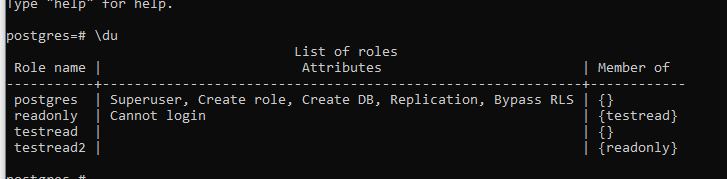

## создайте новый кластер PostgresSQL 
>hdn@denispg:~$ pg_lsclusters

Ver Cluster Port Status Owner    Data directory              Log file

14  main    5432 online postgres /var/lib/postgresql/14/main /var/log/postgresql/postgresql-14-main.log
## создайте новую базу данных testdb
postgres=# CREATE DATABASE testdb;
CREATE DATABASE
## зайдите в созданную базу данных под пользователем postgres
postgres=# \c testdb;
You are now connected to database "testdb" as user "postgres".
## создайте новую схему testnm
postgres=# CREATE SCHEMA testnm;
CREATE SCHEMA
## создайте новую таблицу t1 с одной колонкой c1 типа integer
postgres=# CREATE TABLE t1 (c1 int);
CREATE TABLE
## вставьте строку со значением c1=1
postgres=# INSERT INTO t1 (c1) values(1);
INSERT 0 1
## создайте новую роль readonly
postgres=# CREATE ROLE readonly;
CREATE ROLE
## дайте новой роли право на подключение к базе данных testdb
GRANT CONNECT ON DATABASE testdb to readonly;
## дайте новой роли право на использование схемы testnm
GRANT USAGE ON SCHEMA testnm TO readonly;
## дайте новой роли право на select для всех таблиц схемы testnm
GRANT SELECT ON ALL TABLES IN SCHEMA testnm TO readonly;
## создайте пользователя testread с паролем test123
CREATE USER testread WITH PASSWORD 'test123';
##  ( 12 ) дайте роль readonly пользователю testread
GRANT testread TO readonly;
## зайдите под пользователем testread в базу данных testdb
sudo -su postgres psql -U testread -h localhost -d testdb -W
## сделайте select * from t1;
```
testdb=> select * from t1;
ERROR:  relation "t1" does not exist
```
## напишите что именно произошло в тексте домашнего задания
```
testdb=# \dt
        List of relations
 Schema | Name | Type  |  Owner
--------+------+-------+----------
 public | t1   | table | postgres
```
Таблица не отображается, т.к создалась в схеме public. Необходимо перенести ее в testnm на которую есть права у созданного пользователя testread. 
## вернитесь в базу данных testdb под пользователем postgres и удалите таблицу t1
```
testdb=# drop table t1;
DROP TABLE
```
## создайте ее заново но уже с явным указанием имени схемы testnm
```
testdb=# create table testnm.t1 (i int);
CREATE TABLE
```
## вставьте строку со значением c1=1
```
testdb=# INSERT INTO testnm.t1 values(1);
INSERT 0 1
```
## зайдите под пользователем testread в базу данных testdb и сделайте select * from testnm.t1;
```
testdb=> select * from testnm.t1;
ERROR:  permission denied for schema testnm
LINE 1: select * from testnm.t1;
```
##  есть идеи почему не получилось?
Думаю не получилось из-за того что после удаления таблицы естественным образом слетели и права на эту таблицу 
## как сделать так чтобы такое больше не повторялось? (Решение из шпаргалки)
testdb=# ALTER default privileges in SCHEMA testnm grant SELECT on TABLEs to readonly;

ALTER DEFAULT PRIVILEGES
## сделайте select * from testnm.t1;
```
testdb=> select * from testnm.t1;
ERROR:  permission denied for schema testnm
```
прошлая команда default privileges in SCHEMA будет отрабатывать только для новых таблиц, а прошлый GRANT на все таблицы не действует на t1, потому что она пересоздавалась. Поэтому заново выполним GRANT
```
GRANT SELECT ON ALL TABLES in SCHEMA testnm to readonly;
```
## select * from testnm.t1; 
Не удалось выполнить команду. Ошибка на скриншоте ниже. Пользователь testreader являлся группой readonly, поэтому из под него не получается читать таблицу (опечатка в 12 шаге). После того как корректно завел нового пользователя в группе readonly, select для него работает. 



## теперь попробуйте выполнить команду create table t2(c1 integer); insert into t2 values (2);
```
testdb=> create table t2 (c1 integer);
CREATE TABLE
testdb=> insert into t2 values (2);
INSERT 0 1
testdb=> \dt


          List of relations
 Schema |  Name  | Type  |   Owner
--------+--------+-------+-----------
 public | t2     | table | testread2

(2 rows)
```


Мы можем создавать и делать записи под пользователем testread2 потому что по умолчанию все пользователи могут создавать таблицы и редактировать их в схеме public. Выше видно что таблица создана в public. Явно ограничить эту возможность можно с помощью команды REVOKE.
```
REVOKE ALL PRIVILEGES ON schema public FROM  public;
REVOKE CREATE ON database testdb FROM readonly;
```
Теперь мы не можем создавать таблицы на схеме public
```
testdb=> create table tt (i int);
ERROR:  no schema has been selected to create in
LINE 1: create table tt (i int);
```

## Выводы
Интересное дз, простое на первый взгляд, но шаг влево/вправо - болото. 
1. Сильно залип на ошибке в 12 шаге. Вроде смотрел через метакоманду \du+, а все равно в упор не видел что перепутал роль и пользователя. 
2. Несколько раз забывал переключаться на целевую БД, поэтому гаранты/ревоки не работали.

Суммарно потратил на ДЗ около 3,5 часов (не считая просмотра лекции).


