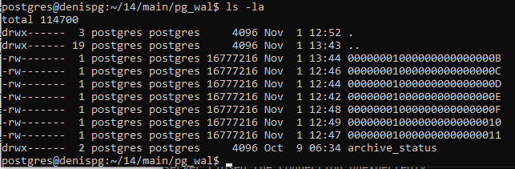
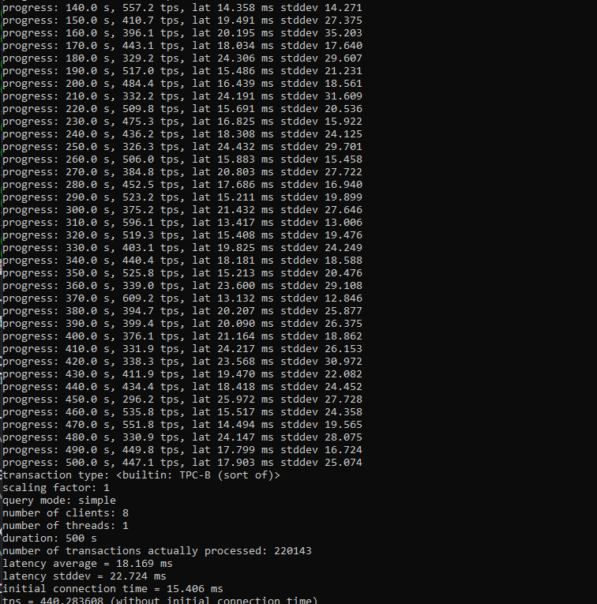

## Настройте выполнение контрольной точки раз в 30 секунд.
	checkpoint_timeout = 30s                # range 30s-1d

## 10 минут c помощью утилиты pgbench подавайте нагрузку. 
выполнил sudo -u postgres pgbench -c8 -P 10 -T 600 -U postgres postgres
transaction type: <builtin: TPC-B (sort of)>
scaling factor: 1
query mode: simple
number of clients: 8
number of threads: 1
duration: 600 s
number of transactions actually processed: 254915
latency average = 18.829 ms
latency stddev = 21.575 ms
initial connection time = 14.275 ms
tps = 424.856959 (without initial connection time)

##  Измерьте, какой объем журнальных файлов был сгенерирован за это время. Оцените, какой объем приходится в среднем на одну контрольную точку.

Получаем 7 файлов по 16Мб ~ 112 Мб общий размер полученных WAL файлов
Таким образом, имея 20 отработанных контрольных точек, получаем объем ~ 5,6 Мб записей в журнал, с одной контрольной точки.

## Проверьте данные статистики: все ли контрольные точки выполнялись точно по расписанию. Почему так произошло?
С помощью системного каталога pg_stat_bgwriter, смотрим счетчик checkpoint_timed до запуска pgbench и после, и обнаруживаем что были пройдены все 20 запланированных чекпоина. 

## Сравните tps в синхронном/асинхронном режиме утилитой pgbench. Объясните полученный результат.

##  Создайте новый кластер с включенной контрольной суммой страниц. Создайте таблицу. Вставьте несколько значений. Выключите кластер. Измените пару байт в таблице. Включите кластер и сделайте выборку из таблицы. Что и почему произошло? как проигнорировать ошибку и продолжить работу?

	$sudo -u postgres pg_createcluster 14 main_test -- --data-checksums
	$sudo systemctl start postgresql@14-main_test

Создаем таблицу и наполняем данными

	postgres=# create table test_table ( c int );
	postgres=# insert into test_table (c) values (1), (2), (3);
	postgres=# show ignore_checksum_failure;
	ignore_checksum_failure
	off
	(1 row)

Узнаем физический путь до файла

	postgres=# select pg_relation_filepath('test_table');
	pg_relation_filepath
	 base/13761/16384
	(1 row)

Отключаем кластер 

	$sudo systemctl stop postgresql@14-main_test

Создаем копию файла 16384

	$sudo systemctl start postgresql@14-main_test
	postgres=# select * from test_table;

WARNING:  page verification failed, calculated checksum 32815 but expected 26124
ERROR:  invalid page in block 0 of relation  base/13761/16384
Получаем ошибку со следующим текстом. Т.к. у нас включен параметр проверки контрольной суммы, то postgres  выбрасывает исключение указывая на не соблюдения целостности данных, поскольку файл был изменен. 

Если отключить проверку контрольной 
	postgres=# set ignore_checksum_failure = on;
	SET
	postgres=# show ignore_checksum_failure;
	ignore_checksum_failure
	 on
	(1 row)

То при выполнении запроса будет выведено предупреждение, но работа с данными будет доступна:
	postgres=# select * from test_table;
	WARNING:  page verification failed, calculated checksum 32815 but expected 26124

