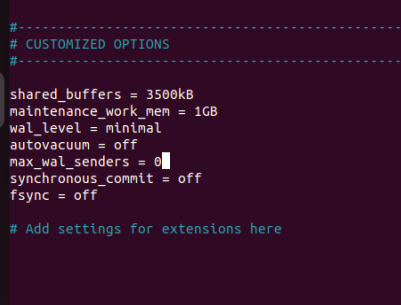

## После установки и развертывания кластера postgres, прогоним тестирование через утилиту sysbench tpcc.

После настройки tpcc, запустим тест производительности на базовой конфигурации кластера postgres 

## настроить кластер PostgreSQL 13 на максимальную производительность не обращая внимание на возможные проблемы с надежностью в случае аварийной перезагрузки виртуальной машины, показать какие параметры в какие значения устанавливали и почему

Дополнительно ознакомившись с параграфом по настройке кластера  pg из официальной документации, измененные параметры конфигурации выглядят следующим образом: 

под shared_buffers выделено 95% RAM всего сервера
wal_level - сохраняет минимальное количество записей об изменениях в бд
fsync - off отключает синхронную запись в wal файл, что позволяет жертвую надежностью данных повысить tps
 
##  повторно нагрузить кластер через утилиту sysbench tpcc и  написать какого значения tps удалось достичь

